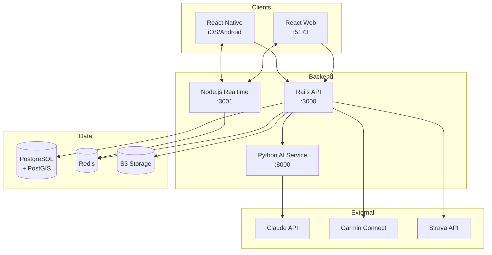
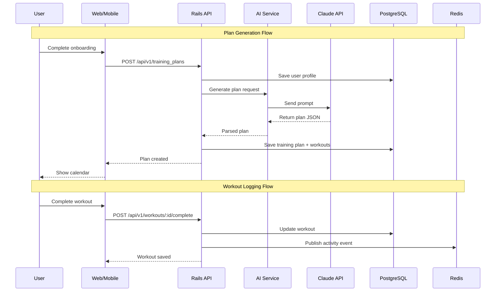

# RunFree

> AI-powered running app with training plans and social features

## Overview

RunFree is a free running app that combines **true AI-generated training plans** with social features. Unlike template-based alternatives, every training plan is uniquely generated based on running science principles and adapts continuously to each runner.

## Tech Stack

| Layer | Technology |
|-------|------------|
| **Web** | React + TypeScript |
| **Mobile** | React Native + Expo |
| **API** | Ruby on Rails |
| **AI Service** | Python + FastAPI + Claude API |
| **Realtime** | Node.js + Socket.io |
| **Database** | PostgreSQL + PostGIS |
| **Cache** | Redis |

## Project Structure

```
runfree/
├── apps/
│   ├── api/              # Rails API + Admin
│   ├── ai-service/       # Python AI microservice
│   ├── web/              # React web app
│   ├── mobile/           # React Native app (Phase 2)
│   └── realtime/         # Node.js WebSocket server (Phase 2)
├── packages/
│   ├── types/            # Shared TypeScript types
│   ├── api-client/       # API client
│   └── ui/               # Shared UI components
├── docker-compose.yml    # Local dev environment
└── Makefile              # Unified commands
```

## Getting Started

### Prerequisites

- Node.js 20+
- pnpm 9+
- Ruby 3.3+
- Python 3.11+
- Docker & Docker Compose

### Setup

```bash
# Clone the repo
git clone git@github.com:lmagsino/runfree.git
cd runfree

# Start database services
docker-compose up -d

# Install dependencies
make install

# Setup database
make db-setup

# Start development
make dev
```

### Commands

```bash
make help          # Show all commands
make dev           # Start all services
make test          # Run all tests
make lint          # Lint all code
```

## Architecture

<!-- Architecture diagrams will be added here -->

### System Architecture



### Data Flow



### Database Schema

*Coming soon*

## Development

### Monorepo Structure

- **Turborepo** manages JS/TS apps (web, mobile, realtime, packages)
- **Rails** and **Python** apps are in the repo but managed separately
- **Docker Compose** unifies local development
- **Makefile** provides common commands across all languages

### Apps

| App | Port | Description |
|-----|------|-------------|
| `api` | 3000 | Rails API + Admin dashboard |
| `ai-service` | 8000 | Python AI microservice |
| `web` | 5173 | React web application |
| `realtime` | 3001 | Node.js WebSocket server |

## License

MIT
